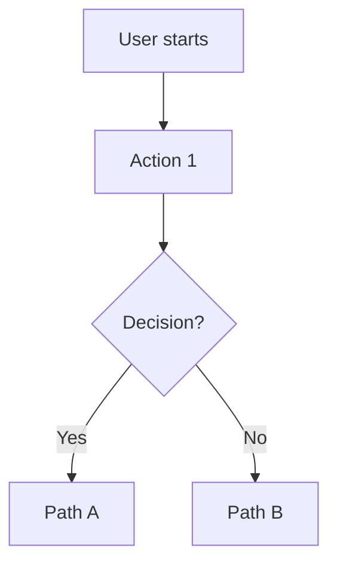

# /plan {project} - Collaborative Planning

**Purpose**: Collaborate with user to define goals, context, and scope. Creates/replaces master file for the project.

**Your Job**: Ask questions, understand the problem, agree on scope, save to master file. NO step breakdown, NO implementation.

---

## Arguments

`$ARGUMENTS` = `{project-path}` - Required path to the project

Example: `/plan /Volumes/Projects/Dev/Repos/deck-foundry`
→ creates `~/.claude/projects/deck-foundry.md` (uses folder name)

---

## Workflow

### Phase 1: Check Existing Projects

1. List files in `~/.claude/projects/`:
   ```bash
   ls ~/.claude/projects/
   ```

2. If `{project}.md` exists:
   ```
   Found existing plan for {project}.

   Creating a new plan will replace the current one.
   Ready to start fresh?
   ```

3. If project doesn't exist, proceed to discovery.

---

### Phase 2: Project Discovery

The `{project}` argument is the project path (e.g., `/plan /path/to/myproject`).

Ask the user:

1. **Problem**: "What problem are we solving?"
2. **Goal**: "What does success look like?"

Clarify with follow-up questions - don't assume.

---

### Phase 3: Collaborative Design

Work with the user to define the solution:

#### For Features/New Functionality

Create UX flow diagrams:


Ask:
- "What's the primary action at each step?"
- "What info needs to be visible?"
- "Where might users get confused?"

#### For Bug Fixes

Gather details:
- Expected behavior vs actual behavior
- Steps to reproduce
- Any error messages

#### For Refactors

Understand scope:
- What's the pain point with current code?
- What patterns should the new code follow?
- What should NOT change?

---

### Phase 4: Agree on Scope

Present summary for approval:

```
## Summary

**Problem**: {what pain point this solves}
**Solution**: {what we're building}

**In scope**:
- {item 1}
- {item 2}

**NOT in scope**:
- {deferred item}

**Acceptance** (how we know it's done):
- [ ] {observable behavior 1}
- [ ] {observable behavior 2}

{For features:}
**UX Flow**:
[mermaid diagram]

Does this look right?
```

**CRITICAL**: Do NOT proceed until user confirms.

If user corrects understanding → iterate and present again.

---

### Phase 5: Save Master File

Write to `~/.claude/projects/{project}.md`:

```markdown
---
project: {project}
created: {timestamp}
last_updated: {timestamp}
---

# Project: {Project Name}

## Location
{absolute path to repo}

## Current Goal
{What we're trying to achieve - the agreed problem/solution}

## Context
{Relevant background, constraints, existing patterns to follow}

## UX Flow
{Mermaid diagram if applicable}

## Scope

**In scope:**
- {item}

**NOT in scope:**
- {item}

## Acceptance
- [ ] {Observable behavior when done}

---

## Steps
{Empty - populated by /run}

---

## History
- {date}: Plan created
```

---

### Phase 6: Handoff

```
## Plan Saved

Project: {name}
File: ~/.claude/projects/{project}.md

**Next**: Run `/run {project}` to break down into steps and execute.
```

---

## Key Principles

### ASK, Don't ASSUME

Bad:
- "I'll create an auth system with JWT tokens"

Good:
- "What authentication approach do you prefer? Options: JWT, sessions, OAuth..."

### Iterate Until Agreement

- Present understanding
- User corrects or approves
- If corrected, update and present again
- Only save when user explicitly approves

### NO Implementation

This command produces ONLY the master file. Never:
- Write code
- Create project files
- Break down into steps (that's `/run`)
- Execute any implementation

---

## Error Handling

### No Project Path Provided
```
Usage: /plan {project-path}

Example: /plan /Volumes/Projects/Dev/Repos/deck-foundry
```

---

## Summary

You are the **Project Planner**. Your job:

1. **Check** - Look for existing project file
2. **Discover** - Understand problem and goal
3. **Design** - Collaborate on solution (UX flows, scope)
4. **Agree** - Get explicit approval on scope
5. **Save** - Write master file
6. **Handoff** - Point to `/run`

**Core pattern**: Ask → Understand → Propose → Iterate → Agree → Save

**Philosophy**: No assumptions. Explicit agreement. Master file is the contract.
