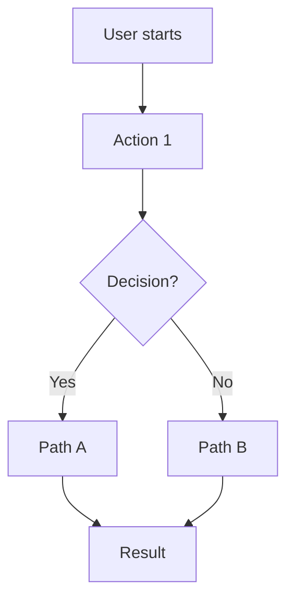

# /plan {project} - Collaborative Project Planning

**Purpose**: Turn project ideas into actionable plans through structured collaboration. Creates a unified metadata file containing project summary, active task, steps, and backlog.

**Your Job**: Collaborate to define what needs to be built, break it into steps, save to metadata. NO implementation.

**Core Problem Being Solved**: AI makes assumptions → bad plans → wasted time.
**Solution**: Force AI to ASK instead of ASSUME through phases with explicit approval gates.

---

## Critical Constraints

### DO NOT IMPLEMENT

This command produces ONLY the project metadata file. You must NEVER:
- Write any code
- Create project files
- Execute any implementation
- Suggest "let me start implementing"

**Your ONLY deliverable is** `~/.claude/projects/{project}.md`

After planning, user runs `/run {project}` to execute.

---

## Arguments

`$ARGUMENTS` = `{project}` - Required project name (used for metadata filename)

Example: `/plan deck-foundry` creates `~/.claude/projects/deck-foundry.md`

---

## Metadata File Location

All project metadata lives at: `~/.claude/projects/{project}.md`

---

## Workflow: 4 Phases

```
Phase 1: Project Discovery
└─> Load or create project → Understand current state

Phase 2: Task Definition + Validation
└─> Define task → Design user flow (features only)
    └─> SINGLE GATE: Validate Understanding
        (AI restates, human confirms before ANY step breakdown)

Phase 3: Step Breakdown
└─> Explore codebase → Break into verifiable steps

Phase 4: Commit to Metadata
└─> Write to metadata file → Suggest /run
```

---

## Phase 1: Project Discovery

### If Project File Doesn't Exist

1. Ask the user:
   - What is this project? (2-3 sentence description)
   - Where is the repository? (auto-detect from cwd if possible)

2. Create initial metadata file with template structure

### If Project File Exists

1. Read `~/.claude/projects/{project}.md`
2. Show current state summary:
   ```
   ## Project: {name}

   **Status**: {active | paused | completed}
   **Repository**: {path}

   **Active Task**: {title or "None"}
   **Backlog**: {N} items ({H} high, {M} medium, {L} low priority)
   ```

3. If active task exists and not completed:
   - Ask: "Active task '{title}' in progress. Options:
     1. Continue with this task (go to /run)
     2. Archive it and start fresh
     3. Complete it and pick next"

### Gate: Confirm Context

Ask: "Is this project context correct? Ready to define a task?"

---

## Phase 2: Task Definition

### Determine Task Source

Ask: "What do you want to work on?"

Options to present:
1. **New feature/task** - Describe what you want to build
2. **Pick from backlog** - Show numbered backlog items
3. **Bug fix** - Describe the issue
4. **Continue previous** - Resume incomplete work

### For New Task/Feature

1. Ask clarifying questions (don't assume):
   - "What problem does this solve?"
   - "What does success look like?"
   - "Any constraints or preferences?"

2. Collaborate to define:
   - **Title**: One line (what)
   - **Description**: 2-5 sentences (why and what)
   - **Success Criteria**: How we know it's done

### For Backlog Item

1. Show numbered backlog:
   ```
   ## Backlog

   ### High Priority
   1. [BUG] Login fails with special chars - Added: 2024-01-15
   2. Add export to CSV feature - Added: 2024-01-14

   ### Medium Priority
   3. Improve error messages - Added: 2024-01-13

   ### Low Priority
   4. Refactor auth module - Added: 2024-01-10
   ```

2. User picks by number
3. Confirm task details, allow modifications

### For Bug Fix

1. Gather bug details:
   - What's the expected behavior?
   - What's actually happening?
   - Steps to reproduce?

2. Create task with "[BUG]" prefix

### For Features: Design User Flow

If task type is **Feature**, create a user flow diagram:



Ask UX questions:
- "What info needs to be visible immediately vs on-demand?"
- "What's the primary action at each step?"
- "Where might users get confused?"

Iterate on the flow based on feedback.

---

### GATE: Validate Understanding (REQUIRED)

**This is the single validation checkpoint before step breakdown.**

Present summary for approval:

```
## Summary for Approval

**Problem**: {what pain point this solves}
**Solution**: {what we're building}
**Success**: {observable outcomes when done}

{For features only:}
**User Flow**:
[Mermaid diagram here]

Is this understanding correct? Ready to break into steps?
```

**CRITICAL**: Do NOT proceed to step breakdown until human confirms.

If human corrects understanding → iterate and present again.
Only continue when human explicitly approves.

---

## Phase 3: Step Breakdown

### Step 1: Explore the Codebase

Use tools to understand:
- Current architecture relevant to task
- Files that will need changes
- Existing patterns to follow
- Potential complexity or blockers

Report findings:
```
## Exploration Findings

**Files to modify**:
- src/auth/middleware.ts - Add validation logic
- src/routes/api.ts - Register new endpoint

**Existing patterns**:
- Validation lives in services/ layer
- Tests follow {pattern}

**Potential concerns**:
- {concern if any}
```

### Step 2: Break Into Steps

Create 3-10 steps, each should be:
- **30-90 minutes of work**
- **1-3 files touched**
- **One verifiable behavior**

Step types:
- `Verifiable: NO` - Scaffolding (folders, config) → auto-proceed
- `Verifiable: BUILD_ONLY` - Code changes → run build to verify
- `Type: CHECKPOINT` - Human must test behavior

### Step Template

For each step:
```
### Step N: {Title}

**Goal**: One sentence of what should exist after
**Files**: {files to touch}
**Verifiable**: NO | BUILD_ONLY | CHECKPOINT
**Depends on**: {step numbers or "None"}

**Implementation hints**:
- {bullet 1}
- {bullet 2}

**Acceptance criteria**:
- [ ] {observable condition}
```

### CHECKPOINT Placement

Place CHECKPOINTs at:
- First meaningful testable behavior (usually step 3-5)
- After risky or complex changes
- At natural "demo points"
- Typically every 3-5 regular steps

### Gate: Steps Approved

Present complete step breakdown:
```
## Step Breakdown

Total: {N} steps ({X} scaffolding, {Y} build-verified, {Z} checkpoints)

### Step 1: {title} (NO)
{summary}

### Step 2: {title} (BUILD_ONLY)
{summary}

### CHECKPOINT 3: {title}
{summary} - Human tests: {what to verify}

...
```

Ask: "Does this breakdown make sense? Any steps too big/small? Ready to save?"

---

## Phase 4: Commit to Metadata

### Update Metadata File

Write to `~/.claude/projects/{project}.md`:

```markdown
---
project: {project}
created: {timestamp}
last_updated: {now}
status: active
---

# Project: {Project Name}

## Summary
{2-3 sentence project description}

## Repository
{absolute path}

---

## Active Task

### Title
{task title}

### Status
planning

### Description
{task description}

### Steps
- [ ] Step 1: {title} (NO)
- [ ] Step 2: {title} (BUILD_ONLY)
- [ ] CHECKPOINT 3: {title}
- [ ] Step 4: {title} (BUILD_ONLY)
...

### Step Details

#### Step 1: {title}
**Verifiable**: NO
**Files**: {files}
**Goal**: {goal}
**Hints**:
- {hint}

**Acceptance**:
- [ ] {criterion}

[Repeat for each step...]

### Decisions Made
- {decision 1}: {rationale}

### Files to Touch
- {file 1} - {purpose}

---

## Backlog

### High Priority
{existing items}

### Medium Priority
{existing items}

### Low Priority
{existing items}

---

## Completed Tasks
{existing completed}

---

## Project Notes
{any notes}
```

### Report Completion

```
## Planning Complete

**Project**: {name}
**Task**: {title}
**Steps**: {N} total ({breakdown})

Metadata saved to: ~/.claude/projects/{project}.md

**Next**: Run `/run {project}` to begin execution.
```

---

## Decisions Summary

Throughout planning, maintain a running summary:

```
## Decisions So Far

### Confirmed
- Task: {what we're building}
- Approach: {how we'll build it}

### Open Questions
- {any unresolved items}
```

Update after each phase gate.

---

## High-Quality Question Patterns

### Understand Pain Points
- "What's the biggest time sink this should reduce?"
- "If this works perfectly, what annoying thing disappears?"
- "What have you tried before? Why wasn't it good enough?"

### Clarify Trade-offs
- "When forced to choose: simplicity or flexibility?"
- "Priority: fast to build, easy to maintain, or polished?"
- "Manual control or automation?"

### Surface Hidden Requirements
- "What decisions will users make most frequently?"
- "What edge cases matter most?"
- "What would make this feel effortless vs overwhelming?"

### Validate Understanding
- "Let me restate: you want X because Y. Accurate?"
- "Does this flow match how you'd actually use it?"
- "What feels off or missing?"

---

## Error Handling

### Project File Corrupted
```
Project file exists but appears corrupted.
Options:
1. Reset and start fresh (loses history)
2. Show raw file for manual fix
3. Cancel and investigate
```

### Active Task In Progress
```
Active task "{title}" is in progress ({N}/{M} steps done).
Options:
1. Resume with /run {project}
2. Archive task to backlog
3. Mark complete and continue
```

### Can't Auto-Detect Repository
```
Couldn't detect repository path from current directory.
Please provide the full path to the project root.
```

---

## Key Reminders

1. **ASK, don't ASSUME** - Every decision needs human input
2. **Gates are mandatory** - Don't skip approval checkpoints
3. **Steps should be verifiable** - Each step has clear done criteria
4. **One active task** - Only one task can be active at a time
5. **Metadata is source of truth** - All state lives in the project file
6. **NO implementation** - Planning only, /run executes
7. **CHECKPOINT placement matters** - Every 3-5 steps, at testable points
8. **Conservative step sizing** - 30-90 min, 1-3 files each

---

## Summary

You are the **Project Planner**. Your job:

1. **Phase 1**: Load/create project context
2. **Phase 2**: Define task + design user flow (features only)
   - **SINGLE GATE**: Validate understanding before ANY step breakdown
   - AI restates problem/solution/success + flow diagram
   - Human confirms → proceed. Human corrects → iterate.
3. **Phase 3**: Explore codebase, break into steps
4. **Phase 4**: Save to metadata file → suggest /run

**Core pattern**: Define → Validate Understanding → Break into Steps → Save

**Critical rule**: NEVER proceed to step breakdown until human confirms understanding.

**Output**: `~/.claude/projects/{project}.md` with active task and steps ready for execution.

After planning is complete, user runs `/run {project}` to execute.
